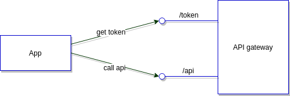
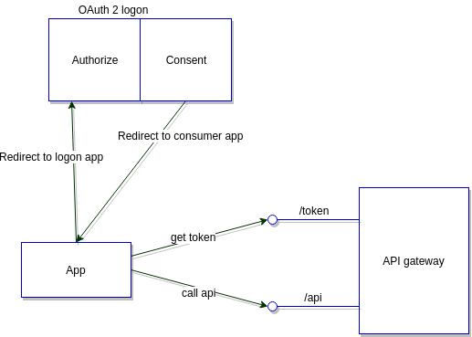

# Authentication

<!-- START doctoc generated TOC please keep comment here to allow auto update -->
<!-- DON'T EDIT THIS SECTION, INSTEAD RE-RUN doctoc TO UPDATE -->

- [OAuth2](#oauth2)
  - [Introductie](#introductie)
  - [SAML](#saml)
  - [Registratie van de applicatie](#registratie-van-de-applicatie)
  - [Authenticeren als een applicatie](#authenticeren-als-een-applicatie)
    - [OAuth2 profiel: client_credentials](#oauth2-profiel-client_credentials)
      - [1) access_token ophalen](#1-access_token-ophalen)
      - [2) API oproepen](#2-api-oproepen)
  - [Authenticeren als een gebruiker](#authenticeren-als-een-gebruiker)
    - [OAuth2 authorizatie server](#oauth2-authorizatie-server)
      - [Versies](#versies)
      - [Parameters](#parameters)
      - [Beschikbare scopes](#beschikbare-scopes)
    - [OAuth2 profiel: authorization_code](#oauth2-profiel-authorization_code)
      - [1) de gebruiker naar de OAuth2 authorizatie applicatie redirecten](#1-de-gebruiker-naar-de-oauth2-authorizatie-applicatie-redirecten)
      - [2) access_token bekomen](#2-access_token-bekomen)
      - [3) API oproepen](#3-api-oproepen)
    - [OAuth2 profiel: implicit](#oauth2-profiel-implicit)
  - [Uitloggen](#uitloggen)
    - [Het uitloggen van een gebruiker initiëren vanuit jouw applicatie](#het-uitloggen-van-een-gebruiker-initi%C3%ABren-vanuit-jouw-applicatie)
    - [De gebruiker in jouw applicatie uitloggen wanneer deze in een andere applicatie uitgelogd is](#de-gebruiker-in-jouw-applicatie-uitloggen-wanneer-deze-in-een-andere-applicatie-uitgelogd-is)

<!-- END doctoc generated TOC please keep comment here to allow auto update -->

# OAuth2

## Introductie

Applicaties kunnen de OAuth2 authorizatie server gebruiken om a/m-profielen te laten authenticeren(authorization_code). Daarnaast ondersteunen we ook de mogelijkheid om applicaties te authenticeren(client_credentials). 

## SAML

Voor alle (web)applicaties raden we aan om gebruikt te maken van OAuth2. 

Indien jouw applicatie toch gebruikt maakt van SAML kan dit alsnog opgezet worden. Gelieve hiervoor contact op te nemen met het APIe-team via Zendesk.

## Registratie van de applicatie

Op de API store kan je jouw eigen applicatie registreren. Deze dien je aan te maken in de organisatie waartoe de applicatie behoort.

Indien je jouw applicatie niet kan onderbrengen in een bestaande organisatie kan je zelf ook één aanmaken.

Voor iedere omgeving is er een aparte omgeving opgezet:
* DEV: https://api-store-o.antwerpen.be
* ACC: https://api-store-a.antwerpen.be
* PROD: https://api-store.antwerpen.be

(Links naar de API Store in deze readme gaan naar de ACC omgeving.)

Nadat je jouw applicatie aangemaakt hebt kan je een contract aanmaken met de [M-Profiel](https://api-store-a.antwerpen.be/#/org/astad/api/mprofiel/v1/documentation), [Shared Identity Data](https://api-store-a.antwerpen.be/#/org/acpaas/api/sharedidentitydata/v1/documentation) en/of [A-Profiel](https://api-store-a.antwerpen.be/#/org/astad/api/aprofiel/v1/documentation) [deprecated] API.

De OAuth2 client_id en client_secret kan je bij de detail gegevens van jouw applicatie vinden. Afhankelijk van de API is er nog een goedkeuring nodig van de beheerder van de API. Deze goedkeuringsflow verloopt geheel automatisch.

De OAuth2 tokens zijn geldig voor alle OAuth2 services waarvoor jouw applicatie een contract heeft.

## Authenticeren als een applicatie

### OAuth2 profiel: client_credentials



#### 1) access_token ophalen

*Request:*

curl -X POST -d "client_id={{CLIENT_ID}}&client_secret={{CLIENT_SECRET}}&grant_type=client_credentials" https://api-gw-p.antwerpen.be/{org}/{service}/{version}/oauth2/token

*Response:*

{"token_type":"bearer","access_token":"8c5b38ffee744ac6bd1e18eae5cbd406","expires_in":7200}

#### 2) API oproepen
*Request:*

curl -v -H "Authorization: Bearer {{ACCESS_TOKEN_FROM_PREVIOUS_STEP}}" 'https://api-gw-p.antwerpen.be/{org}/{service}/{version}/me'

## Authenticeren als een gebruiker

### OAuth2 authorizatie server

De OAuth2 authorizatie server kan je op volgende locatie vinden:
* https://api-oauth2-o.antwerpen.be
* https://api-oauth2-a.antwerpen.be
* https://api-oauth2.antwerpen.be

Een voorbeeld redirect naar de authorizatie applicatie ziet er zo uit:
```
https://api-oauth2.antwerpen.be/v1/authorize?
response_type=code
&service=astad.aprofiel.v1
&client_id=YOUR_CLIENT_ID
&scope=astad.aprofiel.v1.username%20astad.aprofiel.v1.name%20astad.aprofiel.v1.avatar%20astad.aprofiel.v1.email%20astad.aprofiel.v1.phone
&redirect_uri=YOUR_REDIRECT_URI
&state=thisParameterWillBeAddedToTheRedirectUri
&save_consent=true
```

#### Versies

Het authorize endpoint is beschikbaar in deze versies:

**Authenticatie 1.0**

Deze versie is bedoeld voor authenticatie van **medewerkers** in combinatie met de M-Profiel v1 API om het profiel op te halen.

Inloggen voor burgers met de A-Profiel v1 API is ook mogelijk maar is deprecated: gebruik Authenticatie 2.0 voor nieuwe toepassingen.

Authorize endpoint: `/v1/authorize`

**Authenticatie 2.0**

Digipolis Authenticatie 2.0 ondersteunt bijkomende parameters `auth_methods` en `minimal_assurance_level` die het mogelijk maken om de gewenste login methode te sturen. Deze versie kan je gebruiken voor authenticatie van **burgers** in combinatie met de Shared Identity Data v1 API om het profiel op te halen.

Authorize endpoint: `/v2/authorize` \
Documentation: https://acpaas.digipolis.be/nl/docs/identiteit-authenticatie-en-autorisatie

#### Parameters

| Parameter               | v1 | v2 | Verplicht | Omschrijving                                                                                                                                                                                                                                                                                                 |
|:------------------------|:--:|:--:|:---------:|:-------------------------------------------------------------------------------------------------------------------------------------------------------------------------------------------------------------------------------------------------------------------------------------------------------------|
| response_type           | ✓  | ✓  |     ✓     | Voor de authorization_code flow dien je hier 'code' te gebruiken .                                                                                                                                                                                                                                           |
| client_id               | ✓  | ✓  |     ✓     | De client_id die je kan terugvinden bij jouw applicatie in de API store.                                                                                                                                                                                                                                     |
| scope                   | ✓  | ✓  |     ✓     | Een door komma's gescheiden lijst van scopes die de gebruiker dient goed te keuren. Zie [Beschikbare scopes](#beschikbare-scopes).                                                                                                                                                                           |
| redirect_uri            | ✓  | ✓  |     ✓     | De redirect_uri die overeenkomt met diegene die is ingegeven in de API store voor jouw applicatie.                                                                                                                                                                                                           |
| redirect_uri_lng        | ✓  | ✓  |           | Als deze waarde op 'true' staat zal de redirect_uri een extra parameter 'lng' hebben wanneer de gebruiker de OAuth2 authorizatie applicatie verlaat. De waarde voor de 'lng' querystring parameter zal overeenkomen met de taal op de authorizatie applicatie.                                               |
| service                 | ✓  |    |     ✓     | De service die je wil gebruiken om een gebruiker te authenticeren. Dit kan "astad.mprofiel.v1" of "astad.aprofiel.v1" [deprecated] zijn.                                                                                                                                                                     |
| auth_methods            |    | ✓  |     ✓     | De authenticatie methodes voor Digipolis Authenticatie 2.0 (komma gescheiden). Bv. "fas-hintedlogin-bmid,fas-hintedlogin-eid".                                                                                                                                                                               |
| minimal_assurance_level |    | ✓  |     ✓     | Het minimale authenticatie betrouwbaarheidsniveau, nl. hoe sterk een gebruiker zijn identiteit minimaal dient aan te tonen a.d.h.v. een bepaalde authenticatiemethode alvorens zich succesvol te kunnen aanmelden. Bv. "low".                                                                                |
| state                   | ✓  | ✓  |           | We raden aan om deze parameter te voorzien in de redirect naar de authorizatie applicatie met een referentie naar de sessie van de gebruiker. Aangezien de parameter opnieuw zal worden meegeven in de redirect_uri, kan jouw applicatie valideren of de autorisatie flow gestart is vanuit jouw applicatie. |
| lng                     | ✓  | ✓  |           | De taal voor de authorizatie applicatie. Standaard staat deze op 'nl'. Beschikbare talen zijn nl, fr, en, de.                                                                                                                                                                                                |
| force_auth              | ✓  | ✓  |           | Als een gebruiker al een SSO (Single Sign-On) sessie heeft op de achterliggende IDP (IDentity Provider) kan je met deze parameter aangeven dat je de gebruiker verplicht opnieuw wil laten aanmelden.                                                                                                        |
| save_consent            | ✓  | ✓  |           | Als je deze op 'true' zet, zal de authorizatie applicatie de gegeven consent onthouden voor jouw applicatie/gebruiker/scopes.                                                                                                                                                                                |

#### Beschikbare scopes

De beschikbare scopes verschillen per service.

* M-Profiel (astad.mprofiel.v1): all
* Shared Identity Data (acpaas.sharedidentitydata.v1): [zie documentatie](https://bitbucket.antwerpen.be/projects/OAUTH/repos/sharedidentitydata_service_nodejs/browse/scopes.md)
* [deprecated] A-Profiel (astad.aprofiel.v1): username, name, avatar, email, phone, address

De scopes kan je ook terugvinden in de API Store bij de API die bij de service hoort. De tooltip bij "OAuth2 Policy" onder tabblad "Plans & Policies" toont de beschikbare scopes.

### OAuth2 profiel: authorization_code



Als je **medewerkers** in je applicatie wilt laten inloggen en gegevens over deze gebruiker wenst op te halen moet de applicatie een geldig contract hebben met de [MProfiel API](https://api-store-a.antwerpen.be/#/org/astad/api/mprofiel/v1/documentation).

Voor **burgers** is een contract nodig met de [Shared Identity Data API](https://api-store-a.antwerpen.be/#/org/acpaas/api/sharedidentitydata/v1/documentation) (die achterliggend gebruik maakt van A-Profiel) of de [AProfiel v1 API](https://api-store-a.antwerpen.be/#/org/astad/api/aprofiel/v1/documentation) [deprecated].

Technische implementatie details en een werkende NodeJS demo applicatie kan je hier vinden:
https://github.com/digipolisantwerp/demo-oauth2-consumer_app_nodejs

#### 1) de gebruiker naar de OAuth2 authorizatie applicatie redirecten

Een authorization_code kan je bekomen door de gebruiker naar de OAuth2 authorizatie applicatie te redirecten.


#### 2) access_token bekomen

Nadat de gebruiker is ingelogd en zijn goedkeuring(consent) heeft gegeven zal de gebruiker naar de redirect_uri geredirect worden die je hebt ingegeven in de details van uw applicatie op de API store;

Deze redirect_uri bevat een *code* querystring parameter als de authenticatie succesvol is. Bijvoorbeeld:
https://domain.com/callback?code=123

Optioneel worden in deze redirect_uri ook de querystring parameters *lng* en *state* teruggegeven.

*Request:*

curl -X POST -d "client_id={{CLIENT_ID}}&client_secret={{CLIENT_SECRET}}&code={{CODE_FROM_PREV_STEP}}&grant_type=authorization_code" https://api-gw-p.antwerpen.be/{org}/{service}/{version}/oauth2/token

*Response:*
{"refresh_token":"66f0c43c27a94ad4aa2d7574cf7b4465","token_type":"bearer","access_token":"a2824fb10b2a44b2b6f1a4aba382630a","expires_in":7200}

#### 3) API oproepen
curl -v -H "Authorization: Bearer {{ACCESS_TOKEN_FROM_PREVIOUS_STEP}}" 'https://api-gw-p.antwerpen.be/{org}/{service}/{version}/resource'


### OAuth2 profiel: implicit

Hoewel het "implicit" OAuth2 profiel beschikbaar is op de API gateway raden we aan om deze niet te gebruiken.

Voornamelijk omwille van onderstaande redenen:
+ Access_tokens die zijn aangemaakt met de implicit/token flow zijn slechts 2 uur gelding en kunnen niet verlengd worden.
+ Aangezien de client_secret niet gebruikt wordt om een access_token aan te vragen is dit OAuth2 profiel vatbaarder voor security issues.

## Uitloggen

### Het uitloggen van een gebruiker initiëren vanuit jouw applicatie

De OAuth2 authorizatie server bevat ook de mogelijkheid om gebruikers centraal te laten uitloggen.

Om dit te bereiken moet je de gebruiker redirecten naar het redirect endpoint van de OAuth2 authorizatie server:

* Authenticatie 1.0: `/v1/logout/redirect/encrypted`
* Authenticatie 2.0: `/v2/logout/redirect/encrypted`

Querystring parameters:

| Parameter         | v1 | v2 | Verplicht | Omschrijving                                                                                                                                                                                                                                                 |
|:------------------|:--:|:--:|:---------:|:-------------------------------------------------------------------------------------------------------------------------------------------------------------------------------------------------------------------------------------------------------------|
| client_id         | ✓  | ✓  |     ✓     | De client_id die je kan terugvinden bij jouw applicatie in de API store.                                                                                                                                                                                     |
| service           | ✓  |    |     ✓     | De service waarmee de gebruiker zich geauthenticeerd heeft, bv. "astad.aprofiel.v1" of 'astad.mprofiel.v1' zijn.                                                                                                                                             |
| authMethod        |    | ✓  |     ✓     | De authenticatie methode die werd gebruikt bij de login. Deze waarde krijg je terug via de "method" querystring parameter in de callback URL na het inloggen.                                                                                                |
| data              | ✓  | ✓  |     ✓     | Een object met extra data ivm het uitloggen. Deze data is geëncrypteerd volgens sha1 op basis van de client_secret.                                                                                                                                          |
| data.user_id      | ✓  | ✓  |     ✓     | De id van de gebruiker die wenst uit te loggen                                                                                                                                                                                                               |
| data.access_token | ✓  | ✓  |     ✓     | Het access_token van de gebruiker die wenst uit te loggen                                                                                                                                                                                                    |
| data.redirect_uri | ✓  | ✓  |     ✓     | De url op jouw applicatie naar waar de gebruiker geredirect moet worden nadat hij uitgelogd is. Het domein van deze redirect_uri moet overeenkomen met het domein van de redirect_uri (callback) die je in de API Store hebt ingegeven voor het aanlogproces |

Alvorens de gebruiker centraal uit te loggen (via bovenstaande redirect) moet je ook nog de gebruiker sessie in jouw applicatie beëindigen.

### De gebruiker in jouw applicatie uitloggen wanneer deze in een andere applicatie uitgelogd is

Telkens een gebruiker via bovenstaande OAuth applicatie uitgelogd is zal er een event op de EventHandler gepublished worden.

| Namespace | Event                       | Omschrijving                                |
|:----------|:----------------------------|:--------------------------------------------|
| OAuth     | astad.aprofiel.v1.loggedout | Waneer een aprofiel gebruiker uitgelogd is. |
| OAuth     | astad.mprofiel.v1.loggedout | Waneer een mprofiel gebruiker uitgelogd is. |

Het bericht ziet er als volgt uit:

```
{
  user: <user id>,
  service: <de service waarmee de gebruiker aangemeld was>,
  timestamp: <ISO datum en tijd>
}
```
